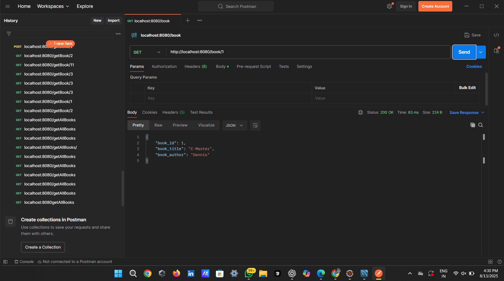

# 📚 BookApp

A simple **Book Management Application** built with **Spring Boot** and **MySQL**.  
Performs CRUD operations on books via REST APIs (tested using Postman).

---

## 🚀 Features
- Add new books
- View all books
- View a single book by ID
- Update existing book details
- Delete a book
- Database integration with MySQL
- API testing using Postman

---

## 🛠️ Tech Stack
- **Backend:** Java, Spring Boot
- **Database:** MySQL
- **Build Tool:** Maven
- **Testing:** Postman

---

## 📷 Screenshots

### 1. Fetch All Books (GET `/book`)

### 2. Fetch Book by ID (GET `/book/{id}`)

### 3. Add New Book (POST `/book`)

### 4. Update Book (PUT `/book/{id}`)

### 5. Delete Book (DELETE `/book/{id}`)

---

## 📦 Setup Instructions

1. **Clone the repository**
git clone https://github.com/Nivi-dev/BookApp.git
cd BookApp
Configure MySQL

2.Create a database named book

Update application.properties with your MySQL username and password

3.Run the application

4.Test APIs using Postman

Import BookApp.postman_collection.json (if available)

Base URL: http://localhost:8080

| Method | Endpoint     | Description         |
| ------ | ------------ | ------------------- |
| GET    | `/book`      | Fetch all books     |
| GET    | `/book/{id}` | Fetch a book by ID  |
| POST   | `/book`      | Add a new book      |
| PUT    | `/book/{id}` | Update a book by ID |
| DELETE | `/book/{id}` | Delete a book by ID |

